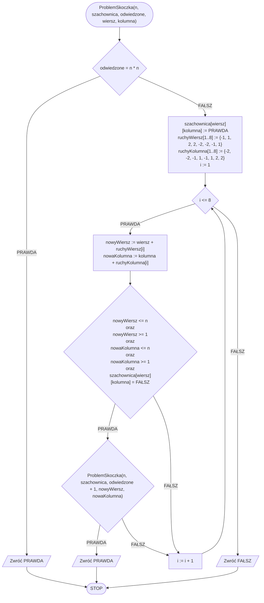

# Problem skoczka

## Opis

Skoczek, zwany inaczej koniem, to figura szachowa która wykonuje ruchy w kształcie litery L, tzn. może przemieścić się o dwa pola w pionie i jedno w poziomie, lub o dwa pola w poziomie i jedno w pionie. Problem związany z tą figurą jest następujący: czy zaczynając z lewego dolnego pola szachownicy skoczek jest w stanie odwiedzić wszystkie pola dokładnie raz?

### Specyfikacja

#### Dane

- $$n$$ - liczba naturalna, wymiary szachownicy, liczba wierszy i kolumn, $$n>0$$.

#### Wynik

- **PRAWDA** jeżeli skoczek może odwiedzić wszystkie pola szachownicy $$n\times n$$ dokładnie raz,
- **FAŁSZ** w przeciwnym przypadku.

## Rozwiązanie

Idea rozwiązania jest stosunkowo prosta. Będziemy rekurencyjnie sprawdzać wszystkie możliwe ruchy skoczka. Gdy dojdziemy do miejsca, z którego nie będziemy mogli już wykonać kolejnego ruchu, to cofniemy się do poprzedniego pola.

### Pseudokod

```
funkcja ProblemSkoczka(n, szachownica, odwiedzone, wiersz, kolumna):
    1. Jeżeli odwiedzone = n * n, to:
        2. Zwróć PRAWDA
    3. szachownica[wiersz][kolumna] := PRAWDA
    4. ruchyWiersz[1..8] := {-1, 1, 2, 2, -2, -2, -1, 1}
    5. ruchyKolumna[1..8] := {-2, -2, -1, 1, -1, 1, 2, 2}
    6. Dla i := 1 do 8, wykonuj:
        7. nowyWiersz := wiersz + ruchyWiersz[i]
        8. nowaKolumna := kolumna + ruchyKolumna[i]
        9. Jeżeli nowyWiersz <= n oraz nowyWiersz >= 1 oraz nowaKolumna <= n oraz nowaKolumna >= 1 oraz szachownica[wiersz][kolumna] = FAŁSZ, to:
            10. Jeżeli ProblemSkoczka(n, szachownica, odwiedzone + 1, nowyWiersz, nowaKolumna), to:
                11. Zwróć PRAWDA
    12. Zwróć FAŁSZ
```

### Schemat blokowy

