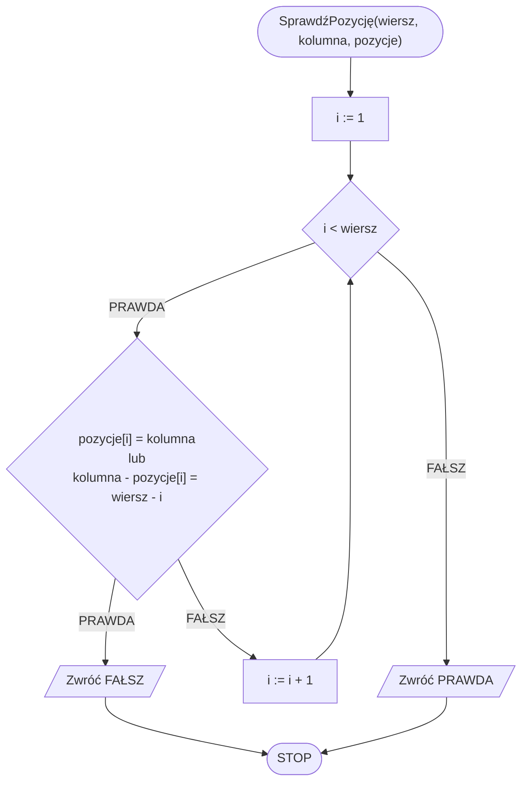
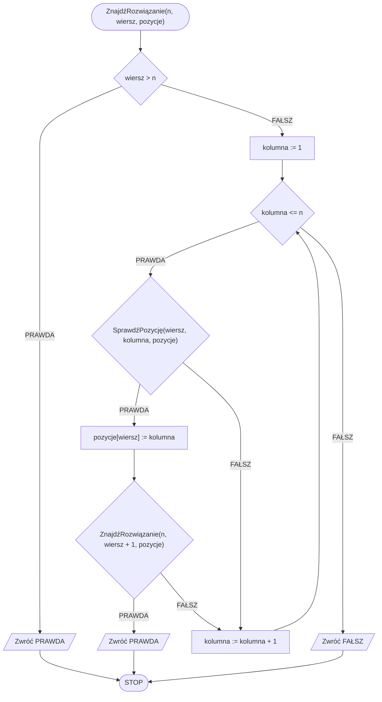

# Problem n królowych

## Opis problemu

### Specyfikacja

#### Dane

* $$n$$ - liczba naturalna, liczba królowych do rozstawienia

#### Wynik

- **PRAWDA** jeżeli istnieje poprawne rozwiązanie
- **FAŁSZ** w przeciwnym przypadku

## Rozwiązanie

Idea naszego rozwiązania jest prosta. Będziemy przechodzić wiersz po wierszu i próbować wszystkie możliwe ustawienia królowych w wierszu. Po ustawieniu królowej w danym wierszu przechodzimy do kolejnego wiersza, gdzie ponownie sprawdzamy wszystkie możliwe ustawienia.

Oczywiście w ten sposób sprawdzalibyśmy wiele błędnych ustawień. Dlatego przed ustawieniem nowej królowej będziemy sprawdzać, czy jest to poprawne ustawienie, tzn. czy to pole nie jest już atakowane przez żadną inną królową.

W celu sprawdzenia, czy dane pole nie jest atakowane przez inną królową, musimy przejść przez wszystkie poprzednie wiersze i sprawdzić, czy królowa ustawiona w danym wierszu nie atakuje obecnego pola w pionie lub na ukos.

### Pseudokod

```
funkcja SprawdźPozycję(wiersz, kolumna, pozycje):
    1. Dla i := 1 do wiersz - 1, wykonuj:
        2. Jeżeli pozycje[i] = kolumna lub kolumna - pozycje[i] = wiersz - i, to:
            3. Zwróć FAŁSZ
    4. Zwróć PRAWDA
```

```
funkcja ZnajdźRozwiązanie(n, wiersz, pozycje):
    1. Jeżeli wiersz > n, to:
        2. Zwróć PRAWDA
    3. Dla kolumna := 1 do n, wykonuj:
        4. Jeżeli SprawdźPozycję(wiersz, kolumna, pozycje), to:
            5. pozycje[wiersz] := kolumna
            6. Jeżeli ZnajdźRozwiązanie(n, wiersz + 1, pozycje), to:
                7. Zwróć PRAWDA
    8. Zwróć FAŁSZ
```

### Schemat blokowy





## Implementacja

### C++


[n-queens.md](../../programming/c++/algorithms/backtracking/n-queens.md)


### Python


[n-queens.md](../../programming/python/algorithms/backtracking/n-queens.md)


### Kotlin


[n-queens.md](../../programming/kotlin/algorithms/backtracking/n-queens.md)
