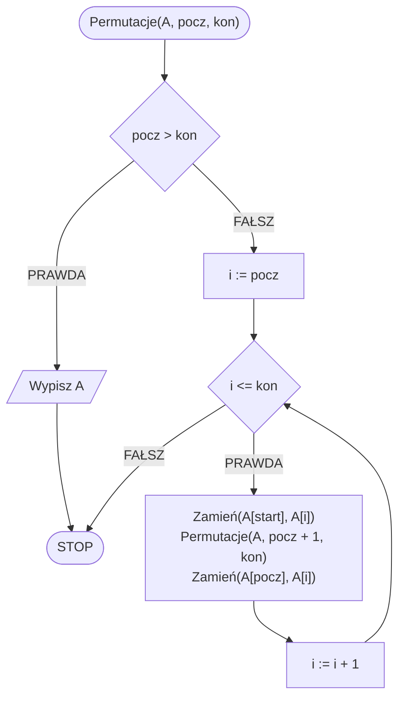

# Permutacje

## Opis problemu

### Specyfikacja

#### Dane

* $$n$$ — liczba naturalna, liczba elementów tablicy, $$n>0$$
* $$A[1..n]$$ - $$n$$-elementowa tablica 

#### Wynik

* Wszystkie permutacje tablicy $$tab$$

### Pseudokod

```
procedura Permutacje(A, pocz, kon):
    1. Jeżeli pocz > kon, to:
        2. Wypisz A
        3. Zakończ
    4. Dla i := pocz do kon, wykonuj:
        5. Zamień(A[start], A[i])
        6. Permutacje(A, pocz + 1, kon)
        7. Zamień(A[pocz], A[i])
```

### Schemat blokowy



## Implementacja

### Kotlin


[permutations.md](../../programming/kotlin/algorithms/backtracking/permutations.md)
