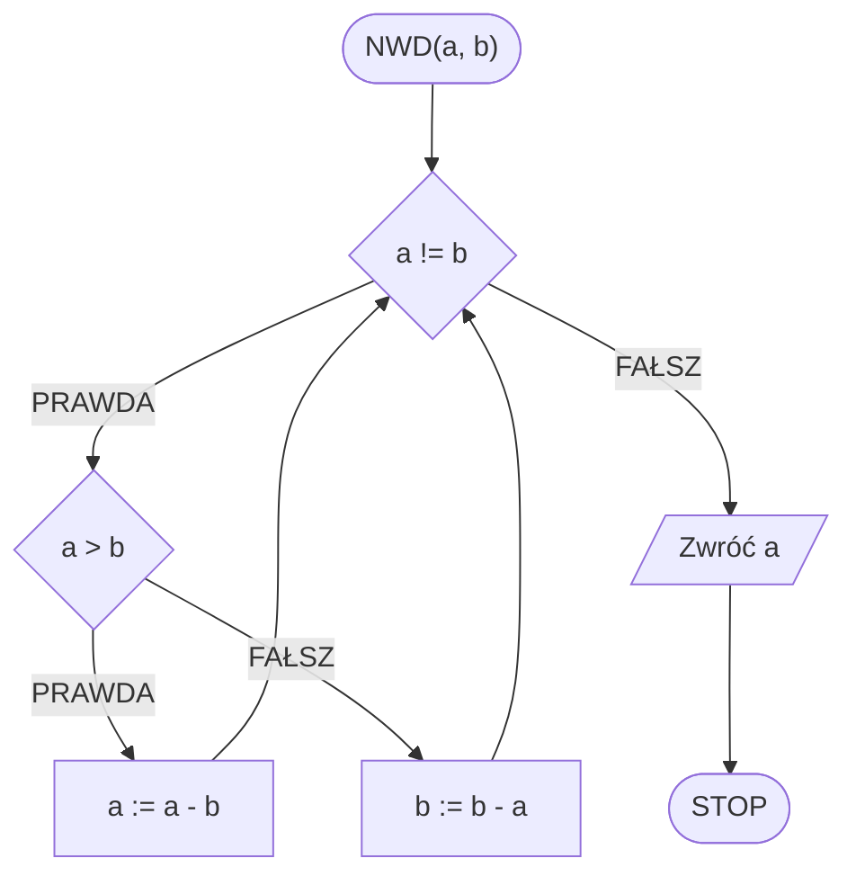
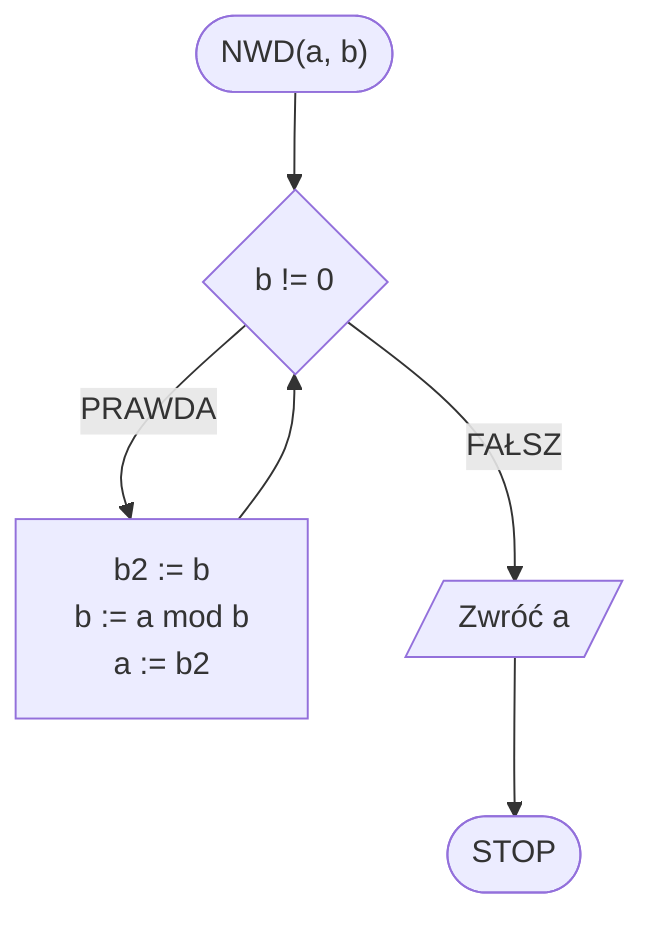
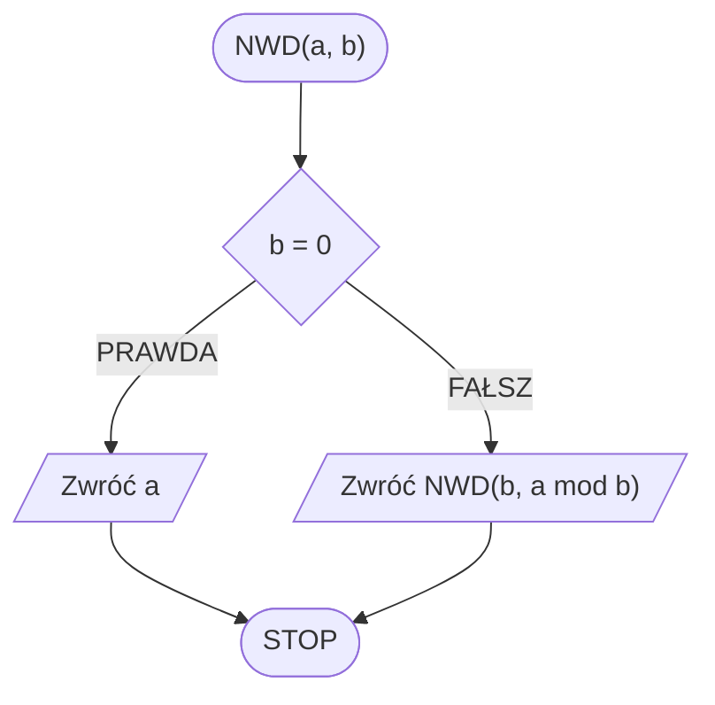

# Algorytm Euklidesa

## Opis problemu

TODO

### Specyfikacja

#### Dane

* $$a, b$$ — liczby naturalne, większe od zera

#### Wynik

* $$NWD(a, b)$$ — największy wspólny dzielnik liczb $$a$$ i $$b$$ 

### Przykład

#### Dane

```
a := 32
b := 12
```

**Wynik**: $$4$$ 


**Wyjaśnienie**

Dzielnikami liczby $$32$$ są: $$1, 2, 4, 8, 16, 32$$

Dzielnikami liczby $$12$$ są: 1, 2, 3, 4, 6, 12

Wspólnymi dzielnikami są więc: $$1, 2, 4$$ 

Największy z nich to właśnie $$4$$.


## Wersja z odejmowaniem

TODO

### Pseudokod

```
funkcja NWD(a, b):
    1. Dopóki a != b, wykonuj:
        2. Jeżeli a > b, to:
            3. a := a - b
        4. W przeciwnym przypadku:
            5. b := b - a
    6. Zwróć a
```

### Schemat blokowy



## Wersja z modulo — iteracyjna

TODO

### Pseudokod

```
funkcja NWD(a, b):
    1. Dopóki b != 0, wykonuj:
        2. b2 := b
        3. b := a mod b
        4. a := b2
    5. Zwróc a
```


**mod** oznacza resztę z dzielenia


### Schemat blokowy



## Wersja z modulo — rekurencyjna

TODO

### Pseudokod

```
funkcja NWD(a, b):
    1. Jeżeli b = 0, to:
        2. Zwróć a i zakończ
    3. Zwróć NWD(b, a mod b) i zakończ
```

### Schemat blokowy



## Implementacja

### C++


[gcd.md](../../programming/c++/algorithms/integers/gcd.md)


### Python


[gcd.md](../../programming/python/algorithms/integers/gcd.md)


### Blockly


[gcd.md](../../programming/blockly/algorithms/integers/gcd.md)


