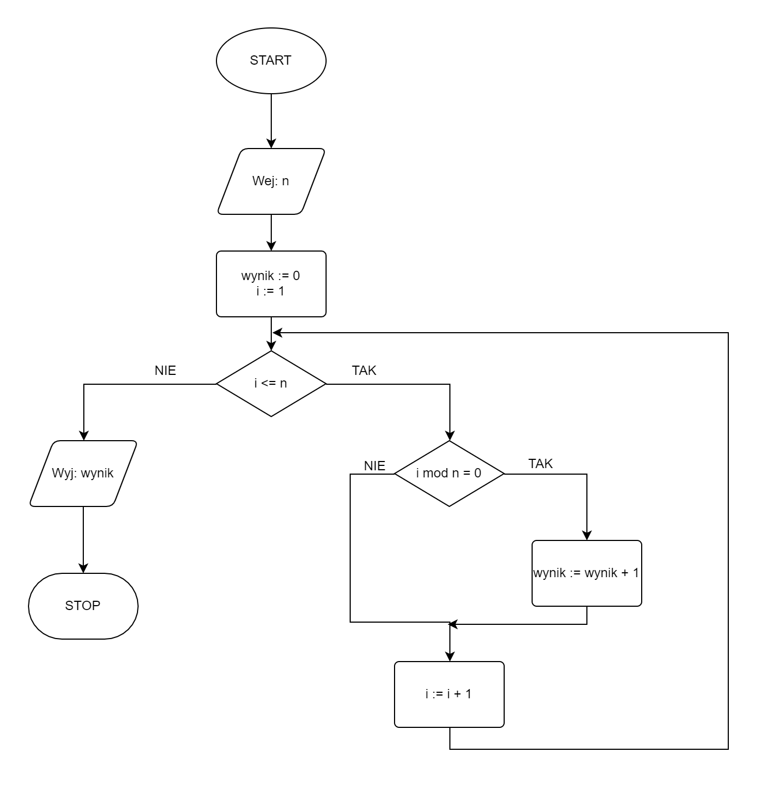

# Sposoby opisu algorytmów

## Wstęp

Wiemy już, czym mniej więcej jest algorytm. Zanim przejdziemy dalej, porozmawiajmy chwilę o sposobie zapisu algorytmów. Jest ich kilka i w naszych materiałach skupimy się na trzech ostatnich, czyli **pseudokodzie**, **schemacie blokowym** i **implementacji**, ale warto poznać także pozostałe. 


Omawiany na tej stronie algorytm ma charakter czysto poglądowy i jego celem jest pokazanie różnic pomiędzy różnymi sposobami zapisu algorytmu. Nie przejmuj się więc, jeżeli teraz coś jest jeszcze niejasne, wszystko zostanie wytłumaczone w kolejnych tematach :)


Ważną częścią każdego algorytmu, jak już wcześniej określiliśmy, jest specyfikacja. Skorzystamy z przykładowej specyfikacji, dla której pokażemy jak ten sam algorytm przedstawia się w różnych formach zapisu.

### Specyfikacja

#### Dane

* $$n$$ - liczba naturalna

#### Wynik

* Liczba wszystkich dzielników $$n$$ 

## Opis słowny

Najmniej formalny ze wszystkich przedstawionych tutaj sposobów opisu algorytmów. Jak nazwa wskazuje, opisujemy algorytm za pomocą własnych słów, nie trzymając się żadnego konkretnego formalizmu. Ze względu na to ten typ opisu może być pomocny przy burzy mózgów i wspólnym rozwiązywaniu problemu, ale zazwyczaj nie będzie wystarczający, jeżeli chcemy przejść do implementacji. Jego wadą może być także brak jednoznaczności.

### Przykład

Po kolei przejdź przez kolejne liczby od $$1$$ do $$n$$ ($$1,2,3,4,...$$). W trakcie przechodzenia przez kolejne liczby zlicz, przez ile z nich $$n$$ jest podzielne, będzie to wynik algorytmu.

## Lista kroków

Bardziej ustrukturyzowany sposób zapisu w porównaniu do opisu słownego, ale wciąż pozbawiony potrzebnej zazwyczaj formalności. W pewnym sensie jest to podzielenie opisu słownego na poszczególne kroki. W zależności od podejścia, lista kroków może być bardzo podobna do pseudokodu.

### Przykład

```
1. Zapamiętaj wynik równy 0
2. Dla kolejnych liczb od 1 do n, wykonuj:
    3. Jeżeli n jest podzielne przez sprawdzaną liczbę, to:
        4. Zwiększ wynik o 1
5. Wypisz wynik
```

## Pseudokod

Pseudokod jest czymś pomiędzy listą kroków, a kodem w wybranym języku programowania. Jak nazwa wskazuje, jest to **pseudo**kod. Mamy więc tutaj do czynienia z zapisem bardziej formalnym, niż lista kroków, ale wciąż podlegającym pewnym umownym zapisom i regułom. Brakuje jednak jednego uzgodnionego formalizmu, można spotkać się więc z wieloma różnymi podejściami do zapisu pseudokodu.

### Przykład

```
1. wynik := 0
2. Od i := 1 do n, wykonuj:
    3. Jeżeli n mod i = 0, to:
        4. wynik := wynik + 1
5. Wypisz wynik
```

## Schemat blokowy

Schemat blokowy jest jednym z najbardziej formalnych i jednoznacznych sposobów zapisu algorytmów. Jak nazwa wskazuje, mamy tutaj do czynienia z blokami, które łączymy ze sobą za pomocą strzałek, oznaczających kolejność wykonywania operacji. Każdy blok ma swój własny typ i przeznaczenie, które definiowane są przez jego kształt. W podstawowym zapisie wyróżniamy następujące bloki:

### Blok startowy


Od niego wszystko się zaczyna. Jego rolą jest określenie początku programu.

### Blok końcowy - terminator


Określa zakończenie obliczeń.

### Blok wejścia


Tutaj wczytujemy dane wejściowe. Ponieważ blok wejścia i wyjścia mają taki sam kształt, dla czytelności dodajemy informację o tym, że wczytujemy dane, zazwyczaj w formie skrótu, np.: wej, czyt, in.

### Blok wyjścia


Tutaj wypisujemy komunikaty i wartości, albo też zwracamy wynik obliczeń. Podobnie jak w przypadku bloku wejściowego dodajemy skrót określający rodzaj operacji, np.: wyj, wyp, out.

### Blok obliczeń


W tym bloku dokonujemy wszelkich obliczeń, a także inicjalizacji i przypisania wartości do zmiennych.

### Blok instrukcji warunkowej


Jedyny blok, z którego wychodzą dwie strzałki, zazwyczaj na lewo i prawo. Do tych strzałek dodajemy zazwyczaj napisy typu "Tak"/"Nie", "Prawda"/"Fałsz", albo "True"/"False" określające, w którym kierunku obliczenia programu powinny dalej podążać w zależności od tego, czy warunek jest spełniony czy też nie.

### Przykład




## Kod w języku programowania

Najbardziej formalnym i dokładnym opisem algorytmu jest jego implementacja w wybranym języku programowania.

### Przykład

#### C++

```cpp
#include <iostream>

using namespace std;

int main() {
    int n, wynik;
    
    cin >> n;
    
    wynik = 0;
    
    for(int i = 1; i <= n; i++) {
        if (n % i == 0) {
            wynik += 1;
        }
    }
    
    cout << wynik << endl;
    
    return 0;
}
```


C++ - przykład


#### Python

```python
n = int(input())

wynik = 0

for i in range(1, n + 1):
    if n % i == 0:
        wynik += 1

print(wynik)
```


Przykład - Python


#### Pascal

```delphi
program dzielniki;
var n, wynik, i: integer;
begin
	read(n);
	
	wynik := 0;
	
	for i:=1 to n do begin
		if n mod i = 0 then begin
			wynik := wynik + 1;
		end;
	end;
	
	writeln(wynik);
end.
```


Przykład - Pascal

