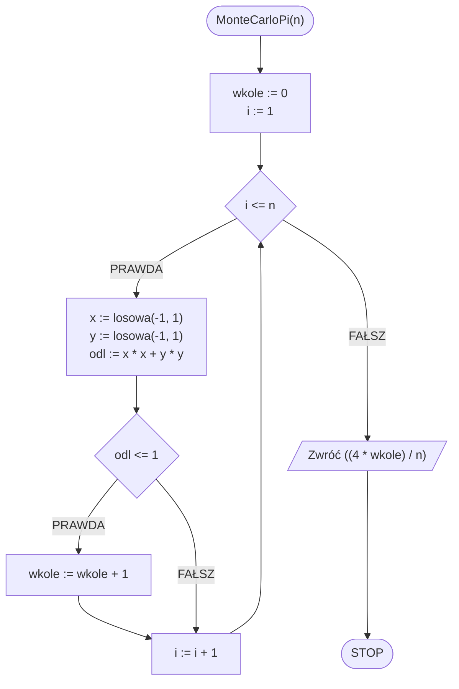

# Metoda Monte Carlo

## Opis problemu

## Obliczanie przybliżonej wartości liczby PI

### Specyfikacja

#### Dane

* $$n$$ — liczba prób (im większa, tym większa dokładność)

#### Wynik

* $$pi$$ — przybliżona wartość liczby $$\pi$$

### Symulacja


Symulacja Monte Carlo


### Rozwiązanie

### Pseudokod

```
funkcja MonteCarloPI(n)
    1. wkole := 0
    2. Dla i := 1 do n, wykonuj:
        3. x := losowa liczba rzeczywista z przedziału [-1, 1]
        4. y := losowa liczba rzeczywista z przedziału [-1, 1]
        5. odl := (x * x) + (y * y)
        6. Jeżeli odl <= 1, to:
            7. wkole := wkole + 1
    
    8. Zwróć (4 * wkole) / n
```

### Schemat blokowy



## Implementacja

### C++


[monte-carlo.md](../../programming/c++/algorithms/numerical-methods/monte-carlo.md)


### Python


[monte-carlo.md](../../programming/python/algorithms/numerical-methods/monte-carlo.md)

