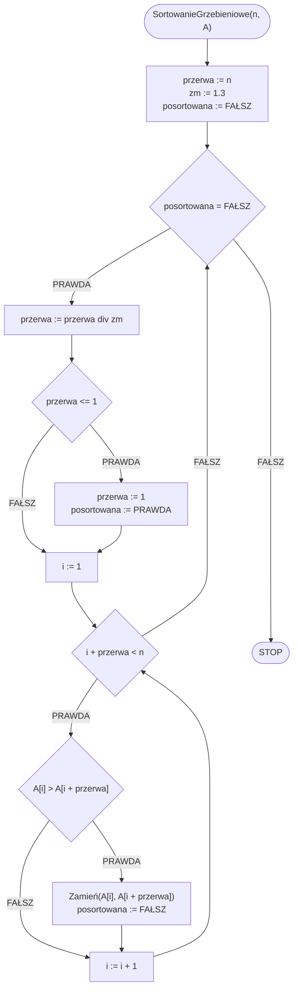

# Sortowanie grzebieniowe

## Opis problemu

### Specyfikacja

#### Dane

* $$n$$ — liczba naturalna, ilość elementów w tablicy
* $$A[1..n]$$ — tablica $$n$$ wartości całkowitych

#### Wynik

* Posortowana niemalejąco tablica $$A$$

### **Przykład**

#### Dane

```
n := 8
A := [6, 5, 3, 1, 8, 7, 2, 4]
```

#### Animacja

{% embed url="https://blackbat13.github.io/visul2/sorting/comb_sort/#array=%5B6%2C5%2C3%2C1%2C8%2C7%2C2%2C4%5D" %}
Sortowanie grzebieniowe


## Rozwiązanie

### Pseudokod

```
procedura SortowanieGrzebieniowe(n, A):
    1. przerwa := n
    2. zm := 1.3
    3. posortowana := FAŁSZ
    4. Dopóki posortowana = FAŁSZ, wykonuj:
        5. przerwa := przerwa div zm
        6. Jeżeli przerwa <= 1, to:
            7. przerwa := 1
            8. posortowana := PRAWDA
        9. i := 1
        10. Dopóki i + przerwa < n, wykonuj:
            11. Jeżeli A[i] > A[i + przerwa], to:
                12. Zamień(A[i], A[i + przerwa])
                13. posortowana := FAŁSZ
            14. i := i + 1
```

### Schemat blokowy



### Złożoność

#### Pesymistyczna

$$O(n^2)$$ — kwadratowa

## Implementacja

### C++


[comb-sort.md](../../programming/c++/algorithms/sorting/comb-sort.md)


### Python


[comb-sort.md](../../programming/python/algorithms/sorting/comb-sort.md)


### Kotlin


[comb-sort.md](../../programming/kotlin/algorithms/sorting/comb-sort.md)
