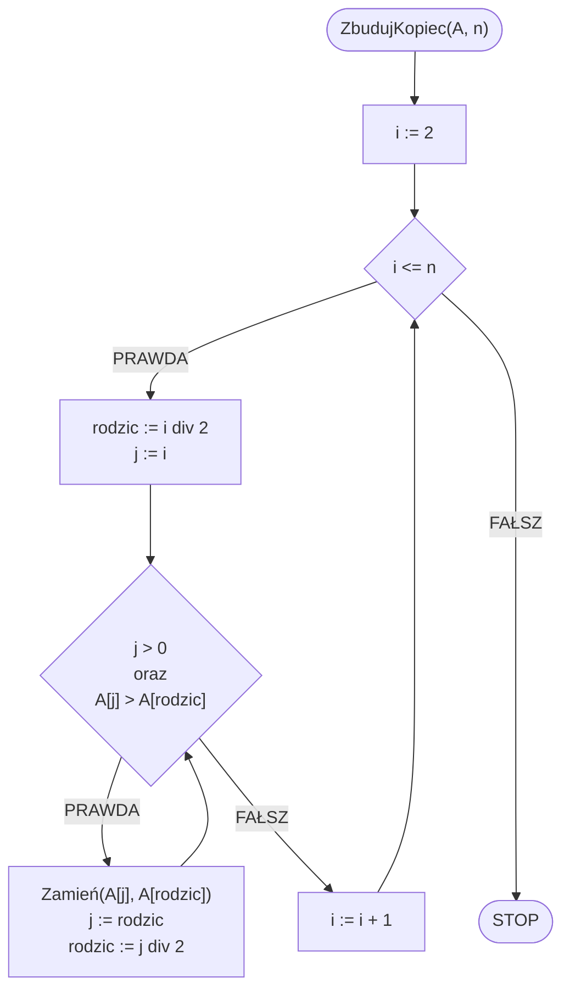
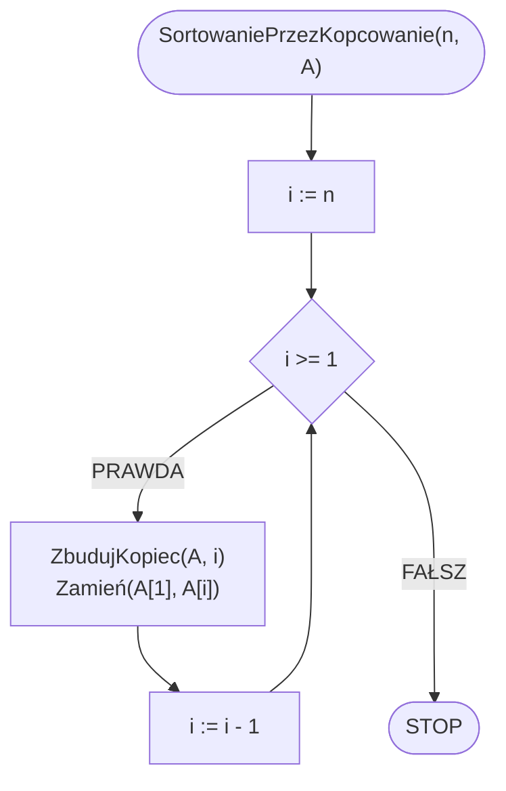

# Sortowanie przez kopcowanie

## Opis problemu

### Specyfikacja

#### Dane:

* $$n$$ — liczba naturalna, ilość elementów w tablicy
* $$A[1..n]$$ — tablica $$n$$ wartości całkowitych

#### Wynik:

* Posortowana niemalejąco tablica $$A$$

### Przykład

#### Dane

```
n := 8
A := [6, 5, 3, 1, 8, 7, 2, 4]
```

#### Animacja


## Rozwiązanie

### Pseudokod

```
procedura ZbudujKopiec(A, n):
    1. Od i := 2 do n, wykonuj:
        2. rodzic := i div 2
        3. j := i
        
        4. Dopóki j > 0 oraz A[j] > A[rodzic]:
            5. Zamień(A[j], A[rodzic])
            6. j := rodzic
            7. rodzic := j div 2
```
            
```
procedura SortowaniePrzezKopcowanie(n, A):
    1. Dla i := n w dół do 1, wykonuj:
        2. ZbudujKopiec(A, i)
        3. Zamień(A[1], A[i])
```

### Schemat blokowy





### Złożoność

$$O(n\log{n})$$ — liniowo logarytmiczna

## Implementacja

### C++


[heap-sort.md](../../programming/c++/algorithms/sorting/heap-sort.md)


### Python


[heap-sort.md](../../programming/python/algorithms/sorting/heap-sort.md)


### Kotlin


[heap-sort.md](../../programming/kotlin/algorithms/sorting/heap-sort.md)
