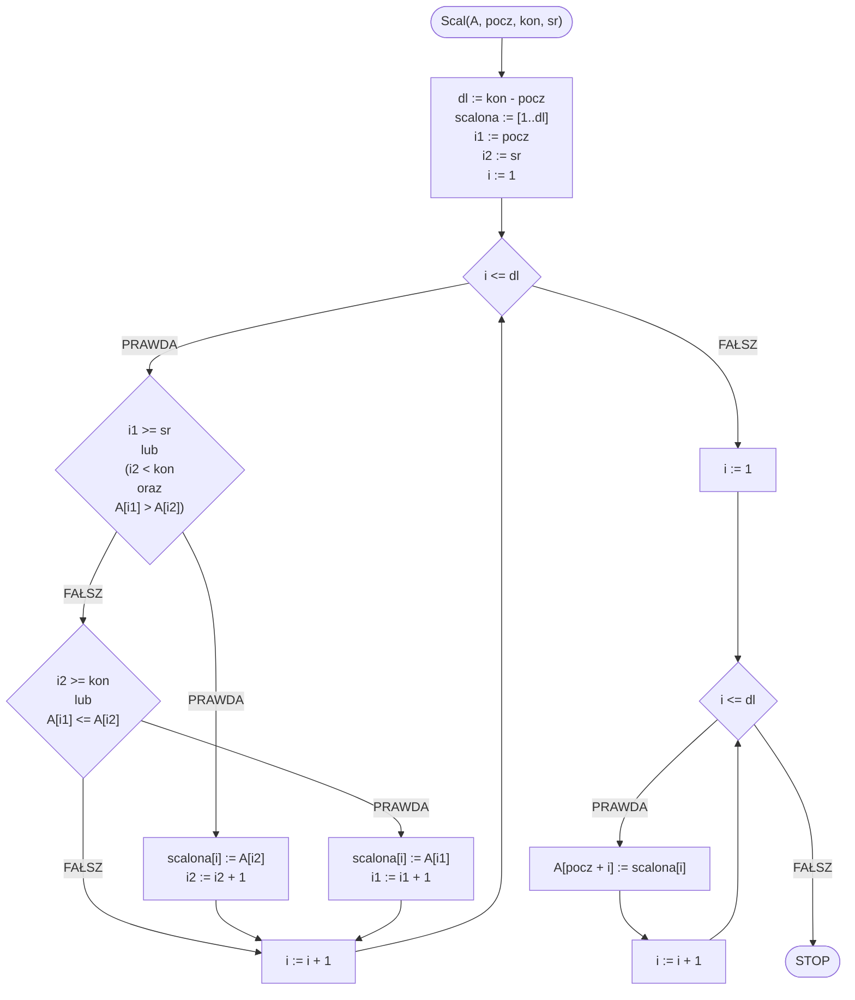
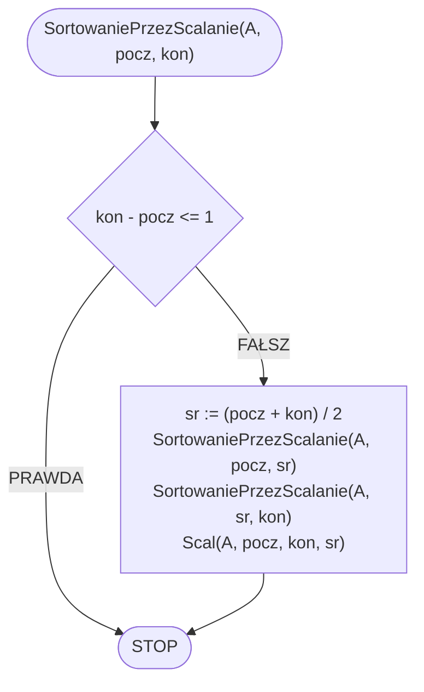

# Sortowanie przez scalanie

## Opis problemu

### Specyfikacja

#### Dane:

* $$n$$ — liczba naturalna, ilość elementów w tablicy
* $$A[1..n]$$ — tablica $$n$$ wartości całkowitych

#### Wynik:

* Posortowana niemalejąco tablica $$A$$&#x20;

### Przykład

#### Dane

```
n := 8
A := [6, 5, 3, 1, 8, 7, 2, 4]
```

#### Animacja


### Prezentacja


Sortowanie przez scalanie


## Rozwiązanie

### Pseudokod

```
procedura Scal(A, pocz, kon, sr):
    1. dl := kon - pocz
    2. scalona := [1..dl]
    3. i1 := pocz
    4. i2 := sr

    5. Dla i := 1 do dl, wykonuj:
        6. Jeżeli i1 >= sr lub (i2 < kon oraz A[i1] > A[i2]), to:
            7. scalona[i] := A[i2]
            8. i2 := i2 + 1
        10. w przeciwnym przypadku, jeżeli i2 >= kon lub A[i1] <= A[i2], to:
            11. scalona[i] := A[i1]
            12. i1 := i1 + 1

    13. Dla i := 1 do dl, wykonuj:
        14. A[pocz + i] := scalona[i]
```

```
procedura SortowaniePrezScalanie(A, pocz, kon):
    1. Jeżeli kon - pocz <= 1, to:
        2. Zakończ

    3. sr := (pocz + kon) div 2
    
    4. SortowaniePrezScalanie(A, pocz, sr)
    5. SortowaniePrezScalanie(A, sr, kon)
    
    6. Scal(A, pocz, kon, sr)
```

### Schemat blokowy





### Złożoność

$$O(n\log{n})$$ — liniowo logarytmiczna

## Implementacja

### C++


[merge-sort.md](../../programming/c++/algorithms/sorting/merge-sort.md)


### Python


[merge-sort.md](../../programming/python/algorithms/sorting/merge-sort.md)


### Kotlin


[merge-sort.md](../../programming/kotlin/algorithms/sorting/merge-sort.md)
