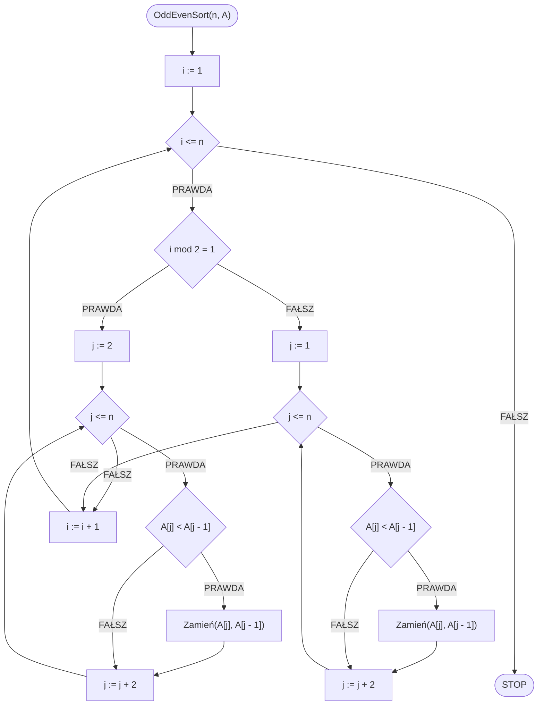

# Sortowanie odd-even

## Opis problemu

### Specyfikacja

#### Dane

* $$n$$ — liczba naturalna, ilość elementów w tablicy
* $$A[1..n]$$ — tablica $$n$$ wartości całkowitych

#### Wynik

* Posortowana niemalejąco tablica $$A$$

### Przykład

#### Dane

```
n := 8
A := [6, 5, 3, 1, 8, 7, 2, 4]
```

#### Animacja

{% embed url="https://blackbat13.github.io/visul2/sorting/odd_even_sort/#array=%5B6%2C5%2C3%2C1%2C8%2C7%2C2%2C4%5D" %}
Sortowanie odd-even


## Rozwiązanie

### Pseudokod

```
procedura OddEvenSort(n, A):
    1. Od i := 1 do n, wykonuj:
        2. Jeżeli i mod 2 = 1, to:
            3. Dla j := 2 do n, z krokiem 2, wykonuj:
                4. Jeżeli A[j] < A[j - 1]:
                    5. Zamień(A[j], A[j - 1])
        6. w przeciwnym przypadku:
            7. Dla j := 1 do n, z krokiem 2, wykonuj:
                8. Jeżeli A[j] < A[j - 1]:
                    9. Zamień(A[j], A[j - 1])
```

### Schemat blokowy



### Złożoność

$$O(n^2)$$ — kwadratowa

## Implementacja

### C++


[odd-even-sort.md](../../programming/c++/algorithms/sorting/odd-even-sort.md)


### Python


[odd-even-sort.md](../../programming/python/algorithms/sorting/odd-even-sort.md)


### Kotlin


[odd-even-sort.md](../../programming/kotlin/algorithms/sorting/odd-even-sort.md)
