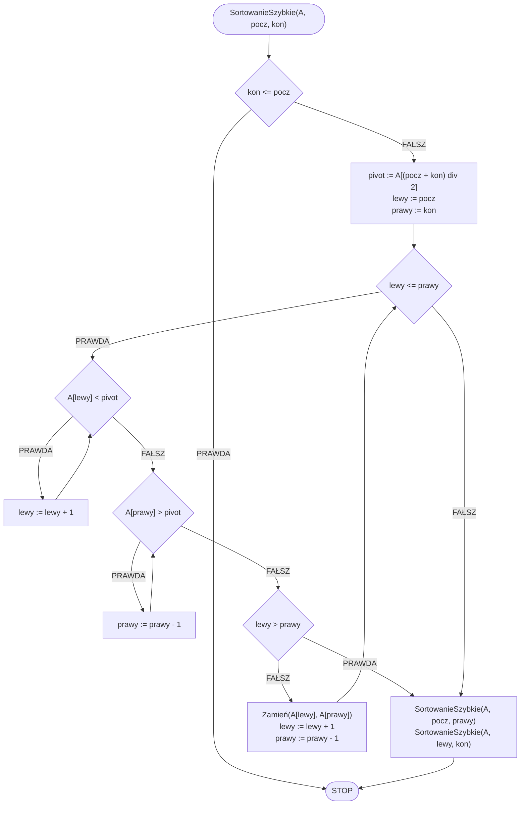

# Sortowanie szybkie

## Opis problemu

Sortowanie szybkie to jeden ze szczególnych algorytmów. W ogólności jest bardzo wydajną metodą sortowania, ale w szczególnych przypadkach jego złożoność jest nie lepsza niż sortowania bąbelkowego.

Sortowanie szybkie opiera się bardzo mocno na rekurencji i podziale tablicy na dwie części. Ogólna idea przedstawia się następująco:
1. Znajdujemy element środkowy, tzw. pivot.
2. Elementy mniejsze przemieszczamy od pivota przemieszczamy na jego lewą stroną, elementy większe natomiast przemieszczamy na prawo.
3. Rekurencyjnie sortujemy lewą część i prawą część tablicy.

### Specyfikacja

#### Dane:

* $$n$$ — liczba naturalna, ilość elementów w tablicy
* $$A[1..n]$$ — tablica $$n$$ wartości całkowitych

#### Wynik:

* Posortowana niemalejąco tablica $$A$$

## Rozwiązanie

By lepiej zrozumieć ten zaawansowany algorytm, prześledźmy jego przebieg na poniższej prezentacji.


Sortowanie szybkie


### Pseudokod

```
procedura SortowanieSzybkie(A, pocz, kon):
    1. Jeżeli kon <= pocz, to:
        2. Zakończ

    3. pivot := A[(pocz + kon) div 2]
    4. lewy := pocz
    5. prawy := kon
    
    6. Dopóki lewy <= prawy, wykonuj:
        7. Dopóki A[lewy] < pivot, wykonuj:
            8. lewy := lewy + 1

        9. Dopóki A[prawy] > pivot, wykonuj:
            10. prawy := prawy - 1

        11. Jeżeli lewy > prawy, to:
            12. Przerwij pętlę

        13. Zamień(A[lewy], A[prawy])

        14. lewy := lewy + 1
        15. prawy := prawy - 1

    16. SortowanieSzybkie(A, pocz, prawy)
    17. SortowanieSzybkie(A, lewy, kon)
```

### Schemat blokowy



### Złożoność

#### Pesymistyczna

$$O(n^2)$$ — kwadratowa

#### Średnia

$$O(n\log{n})$$ — liniowo logarytmiczna

## Implementacja

### C++


[quick-sort.md](../../programming/c++/algorithms/sorting/quick-sort.md)


### Python


[quick-sort.md](../../programming/python/algorithms/sorting/quick-sort.md)


### Kotlin


[quick-sort.md](../../programming/kotlin/algorithms/sorting/quick-sort.md)
