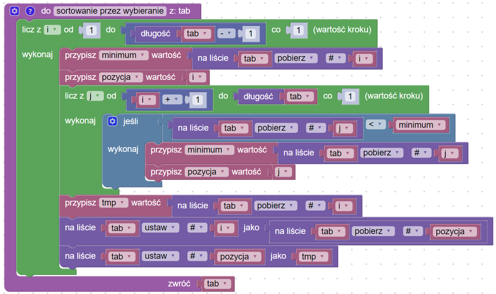

# Sortowanie przez wybieranie

## Opis problemu


[sortowanie-przez-wybieranie.md](../../../../sortowanie/sortowanie-przez-wybieranie.md)


## Implementacja

### Sortowanie

### Kod główny

### Link do implementacji


Sortowanie przez zliczanie

