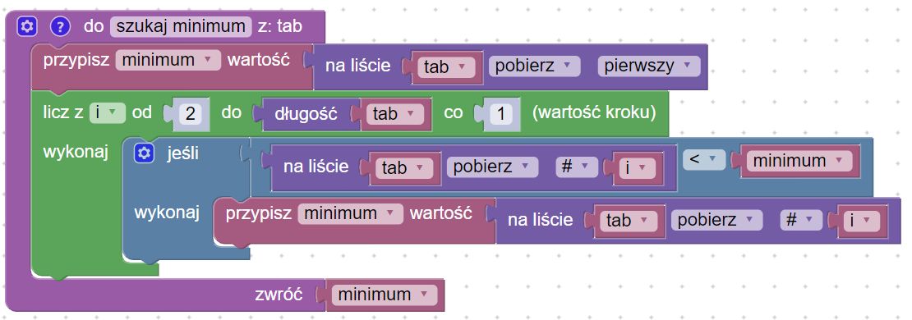
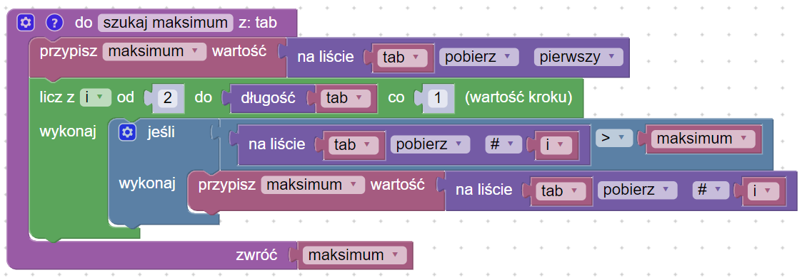

# Wyszukiwanie minimum i maksimum

## Opis problemu


[wyszukiwanie-maksimum.md](../../../../wyszukiwanie/wyszukiwanie-maksimum.md)


## Implementacja

### Znajdowanie minimum

### Znajdowanie maksimum

### Kod główny

### Link do implementacji


Znajdowanie minimum i maksimum

