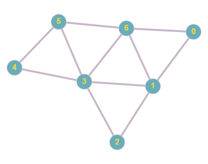

# DFS

## Opis problemu


[dfs.md](../../../../grafowe/dfs.md)


## Implementacja

```cpp
#include <iostream>
#include <vector>
using namespace std;

/// Incidence list of the graph
vector<vector<int> > graph;

/// True if node was visited, false otherwise
vector<bool> visited;

/// Prepares example graph adding vertices to incidence list
void prepareExampleGraph() {
    graph = vector<vector<int> >(7);
    graph[0].push_back(1);
    graph[0].push_back(6);

    graph[1].push_back(0);
    graph[1].push_back(6);
    graph[1].push_back(3);
    graph[1].push_back(2);

    graph[2].push_back(1);
    graph[2].push_back(3);

    graph[3].push_back(2);
    graph[3].push_back(1);
    graph[3].push_back(6);
    graph[3].push_back(4);
    graph[3].push_back(5);

    graph[4].push_back(3);
    graph[4].push_back(5);

    graph[5].push_back(4);
    graph[5].push_back(3);
    graph[5].push_back(6);

    graph[6].push_back(0);
    graph[6].push_back(1);
    graph[6].push_back(3);
    graph[6].push_back(5);
}

/// Recursive dfs algorithm
/// \param node - current node to visit
void dfs(int node) {
    if (visited[node]) {
        return;
    }

    visited[node] = true;
    cout << "Visited node: " << node << endl;
    for (int i = 0; i < graph[node].size(); i++) {
        int next_node = graph[node][i];
        if (!visited[next_node]) {
            dfs(next_node);
        }
    }
}

int main() {
    prepareExampleGraph();
    visited = vector<bool>(graph.size(), false);

    dfs(0);

    return 0;
}
```

### Link do implementacji


Przeszukiwanie grafu w głąb - DFS


### Opis implementacji

Funkcja `prepareExampleGraph` przygotowuje przykładowy graf w formie listy sąsiedztwa zapisanej w dynamicznej tablicy typu `vector`. Przykładowy graf (przedstawiony także na poniższym rysunku) ma 7 wierzchołków (numerowanych od zera) i jest nieskierowany.

Po utworzeniu przykładowego grafu (**linia 62**) przygotowujemy tablicę `visited` i początkowo wypełniamy ją wartościami `false`. W tej tablicy zapamiętujemy dla każdego wierzchołka, czy został on już odwiedzony, czy jeszcze nie. W tej implementacji korzystamy z dynamicznej tablicy typu `vector`, można jednak równie dobrze wykorzystać statyczną tablicę (jeżeli z góry znamy liczbę wierzchołków grafu).

Funkcja `dfs` jest funkcją rekurencyjną, która przyjmuje jeden parametr - numer (identyfikator, indeks) aktualnie odwiedzanego wierzchołka. Na początku sprawdzamy, czy obecny wierzchołek został już odwiedzony. Jeżeli tak, to kończymy działanie funkcji, nie chcemy ponownie przetwarzać już odwiedzonego wierzchołka. Jeżeli wierzchołek nie był jeszcze odwiedzony, to oznaczamy go jako odwiedzonego (**linia 51**), wpisując wartość `true` do tablicy `visited` pod indeksem przetwarzanego wierzchołka. Następnie wypisujemy numer aktualnie przetwarzanego wierzchołka (**linia 52**).

Główną częścią funkcji `dfs` jest pętla przechodząca przez wszystkich sąsiadów aktualnie przetwarzanego wierzchołka (**linia 53**). W pomocniczej zmiennej `next_node` zapamiętujemy numer przetwarzanego sąsiada, pobranego z listy sąsiedztwa (**linia 54**). Następnie sprawdzamy, czy wierzchołek ten był już odwiedzony (**linia 55**), a jeżeli nie, to odwiedzamy go rekurencyjnie wywołując funkcję `dfs` z tym właśnie wierzchołkiem (**linia 56**).




