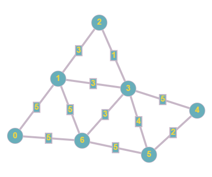

# Dijkstra

## Opis problemu


[dijkstra.md](../../../../algorytmy/grafowe/dijkstra.md)


## Implementacja

```cpp
#include <iostream>
#include <vector>
#include <queue>
#include <climits>

using namespace std;

/// Structure for representing an edge in a weighted graph
struct edge {
	int from;
	int to;
	int distance;
	
	edge(int from, int to, int distance) {
		this->from = from;
		this->to = to;
		this->distance = distance;
	}
};

/// Incidence list of the weighted graph
vector<vector<edge> > graph;

/// Distance to each node from starting node
vector<int> distances;

/// Prepares example graph adding vertices to incidence list
void prepareExampleGraph() {
    graph = vector<vector<edge> >(7);
    graph[0].push_back(edge(0, 1, 5));
    graph[0].push_back(edge(0, 6, 5));

    graph[1].push_back(edge(1, 0, 5));
    graph[1].push_back(edge(1, 6, 5));
    graph[1].push_back(edge(1, 3, 3));
    graph[1].push_back(edge(1, 2, 3));

    graph[2].push_back(edge(2, 1, 3));
    graph[2].push_back(edge(2, 3, 1));

    graph[3].push_back(edge(3, 2, 1));
    graph[3].push_back(edge(3, 1, 3));
    graph[3].push_back(edge(3, 6, 3));
    graph[3].push_back(edge(3, 4, 5));
    graph[3].push_back(edge(3, 5, 4));

    graph[4].push_back(edge(4, 3, 5));
    graph[4].push_back(edge(4, 5, 2));

    graph[5].push_back(edge(5, 4, 2));
    graph[5].push_back(edge(5, 3, 4));
    graph[5].push_back(edge(5, 6, 5));

    graph[6].push_back(edge(6, 0, 5));
    graph[6].push_back(edge(6, 1, 5));
    graph[6].push_back(edge(6, 3, 3));
    graph[6].push_back(edge(6, 5, 5));
}

/// Iterative bfs algorithm
/// \param node - starting node to visit
void dijkstra(int node) {
    queue<edge> edges;

    distances = vector<int>(graph.size(), INT_MAX);
    distances[node] = 0;

    for (int i = 0; i < graph[node].size(); i++) {
        edges.push(graph[node][i]);
    }

    while (!edges.empty()) {
    	  edge current = edges.front();
        edges.pop();

        int new_distance = distances[current.from] + current.distance;

        if (new_distance >= distances[current.to]) {
            continue;
        }

        distances[current.to] = new_distance;

        for (int i = 0; i < graph[current.to].size(); i++) {
            edges.push(graph[current.to][i]);
        }
    }
}

int main() {
    prepareExampleGraph();

    dijkstra(0);

    for (int i = 0; i < distances.size(); i++) {
        cout << distances[i] << " ";
    }

    cout << endl;

    return 0;
}
```

### Link do implementacji


Algorytm Dijkstry


### Opis implementacji

TODO





