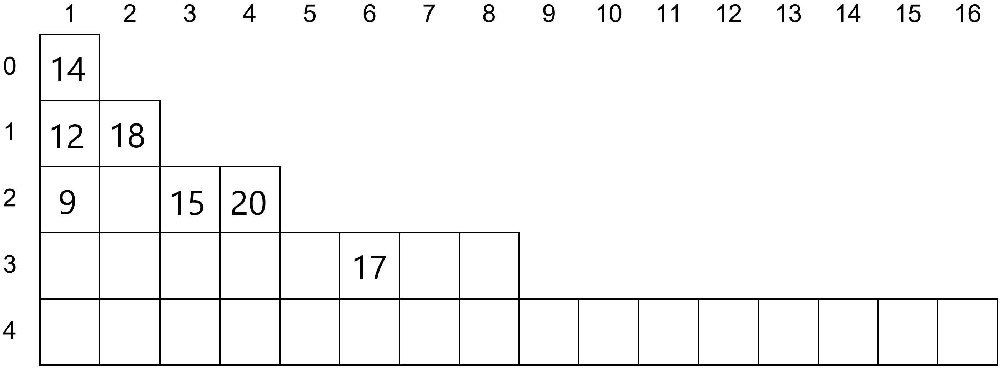

# Rozwiązania

## Zadanie 1

### 1.1



### 1.2

| $$n$$ - liczba książek | Minimalna liczba półek | Maksymalna liczba półek |
|-|-|-|
| 1 | 1 | 1 |
| 3 | 2 | 3 | 
| 4 | 3 | 4 |
| 7 | **3**  | **7** |
| 16 | 5 | **16** |
| 31 | **5** | **31** |
| 32 | **6** | **32** |
| $$2^k - 1$$, dla $$k>0$$ | $$k$$ | $$2^k - 1$$ |


### 1.3

a) $$9, 2, 12, 10, 14, 13, 15$$ 

b) $$10, 8, 4, 6, 15, 12, 13$$

## Zadanie 2

### 2.1

```
1. b := 1
2. ostatnia := n mod 2
3. n := n div 2
4. Dopóki n > 0, wykonuj:
    5. Jeżeli n mod 2 != ostatnia:
        6. b := b + 1
        7. ostatnia := n mod 2
    8. n := n div 2
9. Wypisz b
```

### 2.2

TODO

### 2.2

TODO

### 2. 4

$$(123_{10} \oplus 101101_2) \oplus 2D_{16} = 123_{10}$$

### 2.5

TODO

## Zadanie 3

### 3.1

TODO

### 3.2

TODO

### 3.3

TODO

### 3.4

TODO

## Zadanie 4

1. **P**
2. **F**

## Zadanie 5

$$134_5 < 134_6$$

$$2222_3 < 1111_6$$

## Zadanie 6


Rozwiązanie - Excel


## Zadanie 7


Rozwiązanie - Access


### 7.2

```SQL
SELECT SUM(cena) FROM Sklep LEFT JOIN Gry USING(id_gry) WHERE kategoria="logiczna" AND promocja=true GROUP BY Sklep.id_gry;
```
