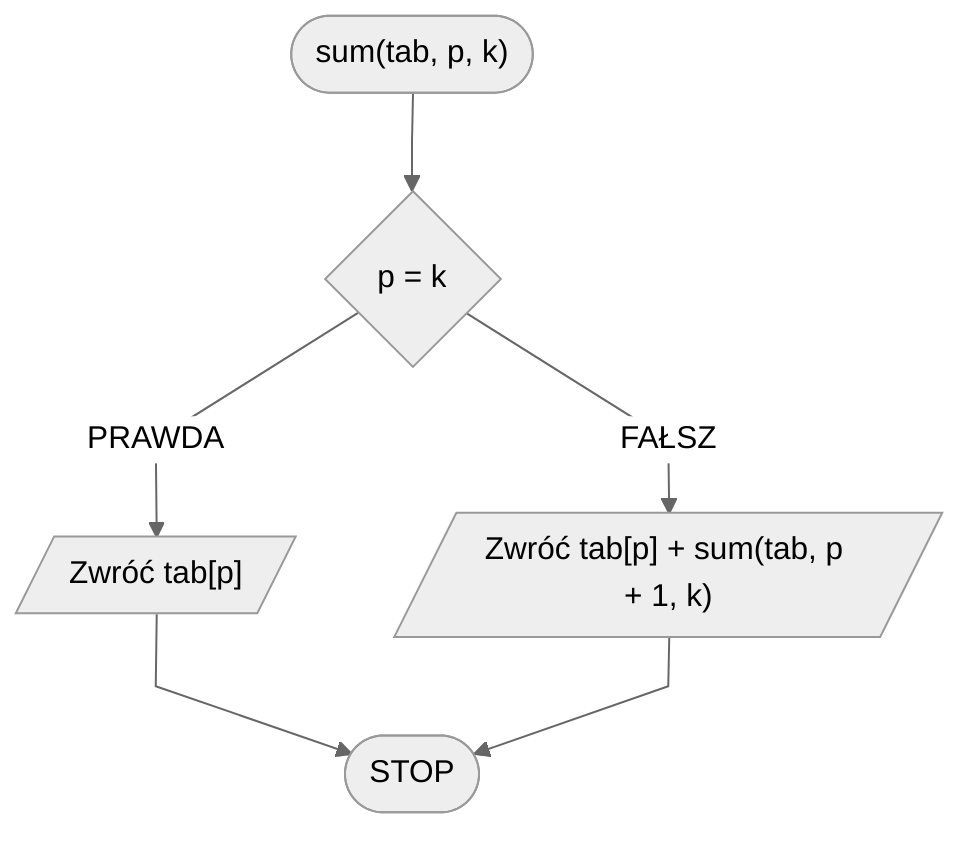

# Zadanie 2 - rozwiązanie

```mermaid
%%{init: {"flowchart": {"curve": "linear"}, "theme": "neutral"} }%%
flowchart TD
	START(["sum(tab, p, k)"]) --> K1{p = k}
	K1 -- PRAWDA --> K2[/"Zwróć tab[p]"/]
	K2 --> STOP([STOP])
	K1 -- FAŁSZ --> K3[/"Zwróć tab[p] + sum(tab, p + 1, k)"/]
    K3 --> STOP
```
