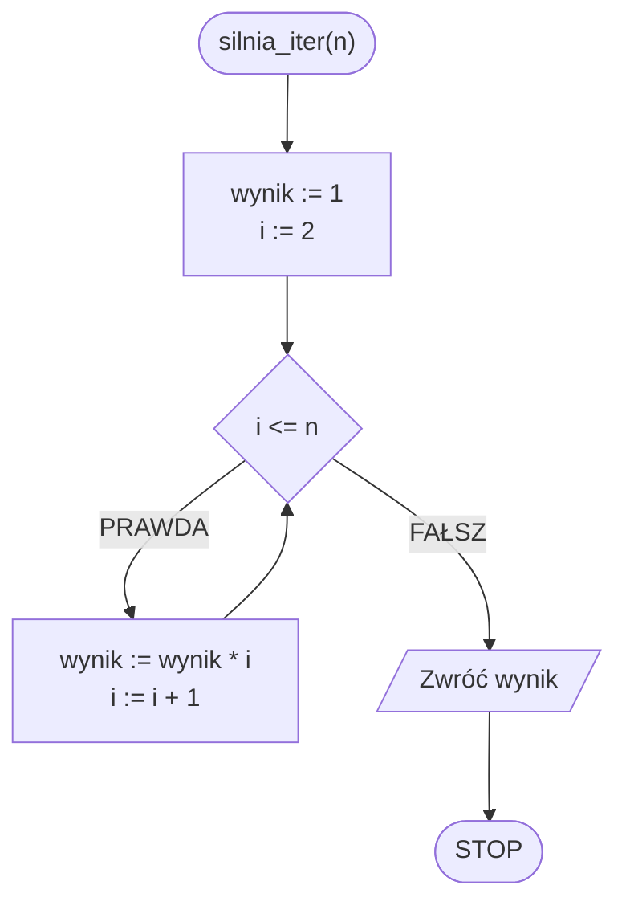

# Zadanie 2 - rozwiązanie

```mermaid
flowchart TD
	START(["silnia_iter(n)"]) --> K1[wynik := 1 \n i := 2]
	K1 --> K2{i <= n}
	K2 -- PRAWDA --> K3[wynik := wynik * i \n i := i + 1]
    K3 --> K2
	K2 -- FAŁSZ --> K4[/Zwróć wynik/]
    K4 --> STOP([STOP])
```
