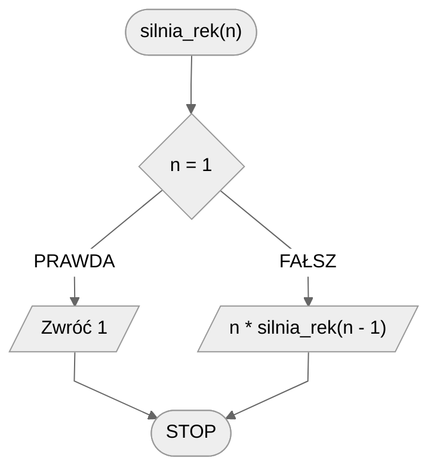

# Zadanie 4 - rozwiązanie

```mermaid
%%{init: {"flowchart": {"curve": "linear"}, "theme": "neutral"} }%%
flowchart TD
	START(["silnia_rek(n)"]) --> K1{n = 1}
	K1 -- PRAWDA --> K2[/Zwróć 1/]
	K2 --> STOP([STOP])
	K1 -- FAŁSZ --> K3[/"n * silnia_rek(n - 1)"/]
    K3 --> STOP
```
