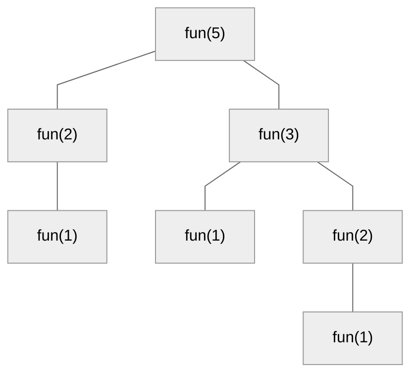

# Zadanie 1 - rozwiązanie

```mermaid
%%{init: {"flowchart": {"curve": "linear"}, "theme": "neutral"} }%%
flowchart TD
	R["fun(5)"] --- R1["fun(2)"]
    R --- R2["fun(3)"]
    R1 --- R11["fun(1)"]
    R2 --- R21["fun(1)"]
    R2 --- R22["fun(2)"]
    R22 --- R221["fun(1)"]
```
