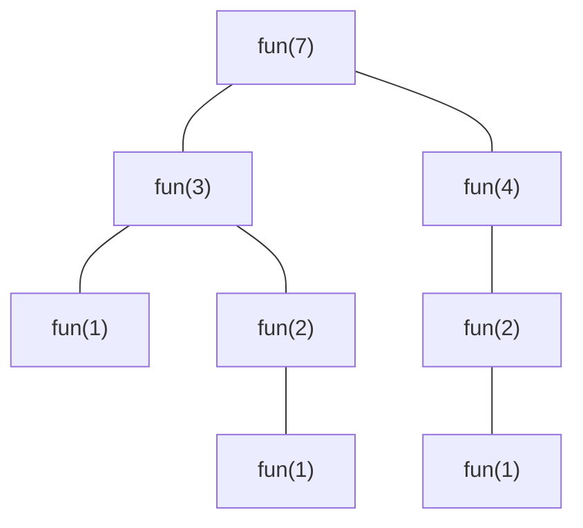

# Zadanie 2 - rozwiązanie

```mermaid
flowchart TD
	R["fun(7)"] --- R1["fun(3)"]
    R --- R2["fun(4)"]
    R1 --- R11["fun(1)"]
    R1 --- R12["fun(2)"]
    R12 --- R121["fun(1)"]
    R2 --- R21["fun(2)"]
    R21 --- R211["fun(1)"]
```
