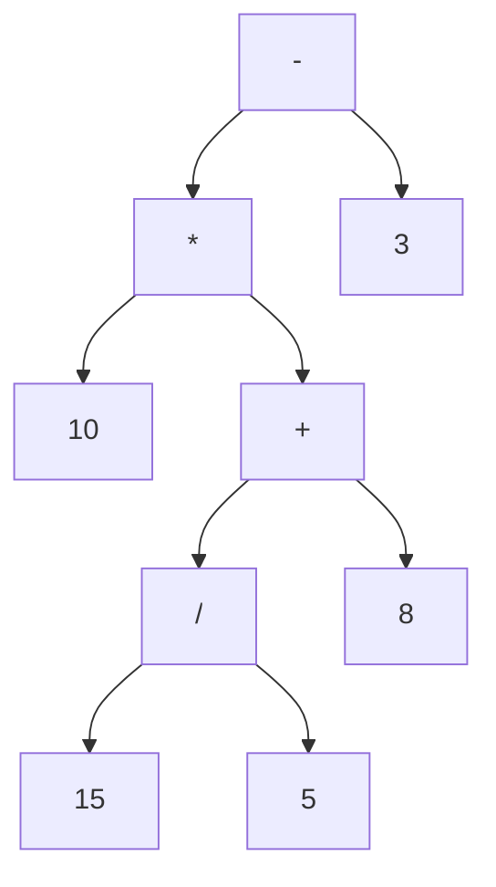
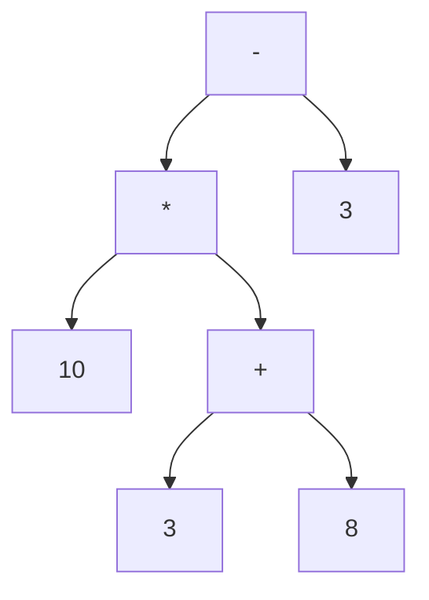
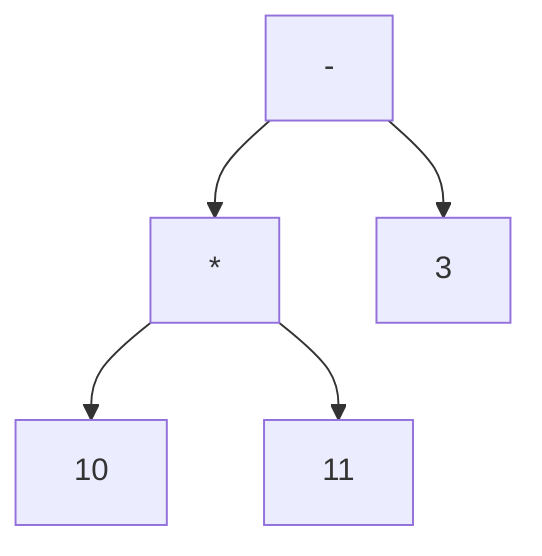
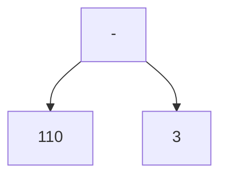
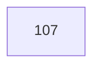

# Zadanie 1

## Drzewo 1

```mermaid
flowchart TD
    op1["-"] --> op2["*"]
    op2 --> n1["10"]
    op2 --> op3["+"]
    op3 --> op4["/"]
    op3 --> n2["8"]
    op4 --> n3["15"]
    op4 --> n4["5"]
    op1 --> n5["3"] 
```

## Drzewo 2

```mermaid
flowchart TD
    op1["-"] --> op2["*"]
    op2 --> n1["10"]
    op2 --> op3["+"]
    op3 --> op4["3"]
    op3 --> n2["8"]
    op1 --> n5["3"] 
```

## Drzewo 3

```mermaid
flowchart TD
    op1["-"] --> op2["*"]
    op2 --> n1["10"]
    op2 --> op3["11"]
    op1 --> n5["3"] 
```

## Drzewo 4

```mermaid
flowchart TD
    op1["-"] --> op2["110"]
    op1 --> n5["3"] 
```

## Drzewo 4

```mermaid
flowchart TD
    op1["107"]
```

## Wynik

$$10 * ((15 / 5) + 8) - 3 = 107$$
