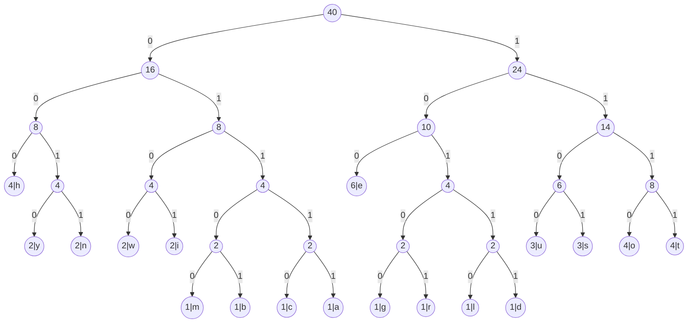

# Zadanie 1 - rozwiązanie

## Drzewo kodów

```mermaid
flowchart TD
    root((40)) --0--> l((16))
    root --1--> r((24))
    l --0--> l1((8))
    l --1--> r1((8))
    r --0--> l2((10))
    r --1--> r2((14))
    l1 --0--> l11(("4|h"))
    l1 --1--> r11((4))
    r1 --0--> l12((4))
    r1 --1--> r12((4))
    l2 --0--> l21(("6|e"))
    l2 --1--> r21((4))
    r2 --0--> l22((6))
    r2 --1--> r22((8))
    r11 --0--> l111(("2|y"))
    r11 --1--> r111(("2|n"))
    l12 --0--> l121(("2|w"))
    l12 --1--> r121(("2|i"))
    r12 --0--> l122((2))
    r12 --1--> r122((2))
    r21 --0--> l212((2))
    r21 --1--> r212((2))
    l22 --0--> l221(("3|u"))
    l22 --1--> r221(("3|s"))
    r22 --0--> l222(("4|o"))
    r22 --1--> r222(("4|t"))
    l122 --0--> l1221(("1|m"))
    l122 --1--> r1221(("1|b"))
    r122 --0--> l1222(("1|c"))
    r122 --1--> r1222(("1|a"))
    l212 --0--> l2121(("1|g"))
    l212 --1--> r2121(("1|r"))
    r212 --0--> l2122(("1|l"))
    r212 --1--> r2122(("1|d"))
```
