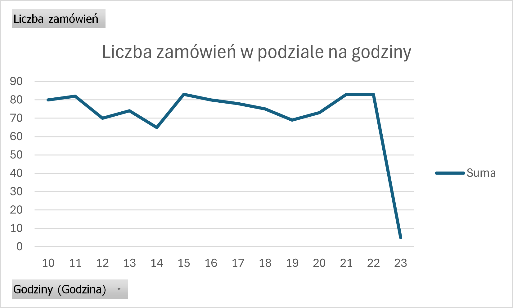
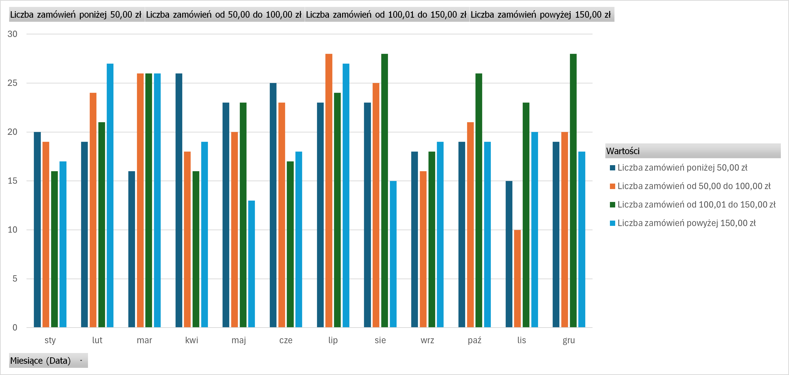

# Odpowiedzi

## Zadanie 1

|      **Rodzaj**     | **Napój ciepły** | **Napój zimny** | **Przystawka** | **Danie główne** | **Deser** |
|:-------------------:|:----------------:|:---------------:|:--------------:|:----------------:|:---------:|
| **Liczba zamówień** |        $$530$$       |       $$528$$       |       $$516$$      |        $$519$$       |    $$498$$    |

## Zadanie 2

| **Godzina** | **Liczba zamówień** |
|:-----------:|:-------------------:|
|      10     |          80         |
|      11     |          82         |
|      12     |          70         |
|      13     |          74         |
|      14     |          65         |
|      15     |          83         |
|      16     |          80         |
|      17     |          78         |
|      18     |          75         |
|      19     |          69         |
|      20     |          73         |
|      21     |          83         |
|      22     |          83         |
|      23     |          5          |

## Zadanie 3

|  **Typ dnia** | **Liczba zamówień** |
|:-------------:|:-------------------:|
| dzień roboczy |         707         |
|    weekend    |         293         |

## Zadanie 4

| **Miesiąc** | **Liczba zamówień poniżej 50,00 zł** | **Liczba zamówień od 50,00 do   100,00 zł** | **Liczba zamówień od 100,01 do   150,00 zł** | **Liczba zamówień powyżej 150,00   zł** |
|:-----------:|:------------------------------------:|:-------------------------------------------:|:--------------------------------------------:|:---------------------------------------:|
|     sty     |                  20                  |                      19                     |                      16                      |                    17                   |
|     lut     |                  19                  |                      24                     |                      21                      |                    27                   |
|     mar     |                  16                  |                      26                     |                      26                      |                    26                   |
|     kwi     |                  26                  |                      18                     |                      16                      |                    19                   |
|     maj     |                  23                  |                      20                     |                      23                      |                    13                   |
|     cze     |                  25                  |                      23                     |                      17                      |                    18                   |
|     lip     |                  23                  |                      28                     |                      24                      |                    27                   |
|     sie     |                  23                  |                      25                     |                      28                      |                    15                   |
|     wrz     |                  18                  |                      16                     |                      18                      |                    19                   |
|     paź     |                  19                  |                      21                     |                      26                      |                    19                   |
|     lis     |                  15                  |                      10                     |                      23                      |                    20                   |
|     gru     |                  19                  |                      20                     |                      28                      |                    18                   |

## Zadanie 5

Napój ciepły + napój zimny + przystawka + danie główne (42 zamówienia).