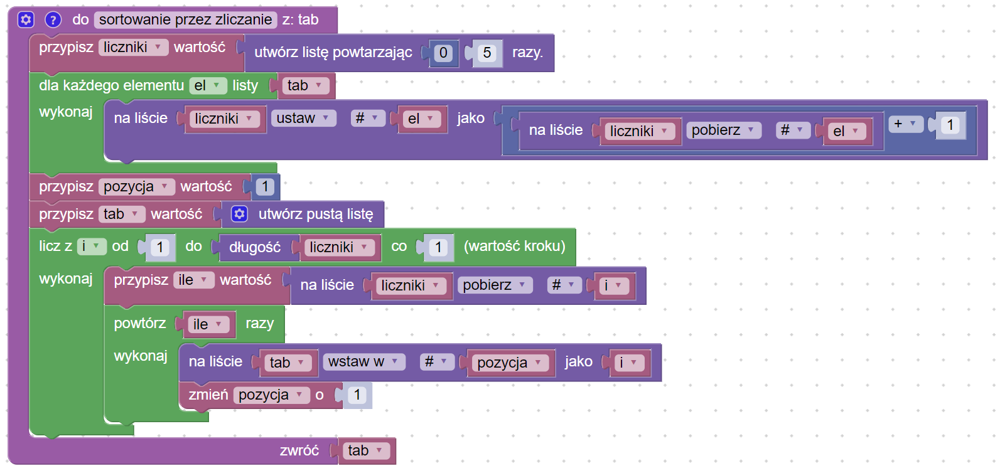
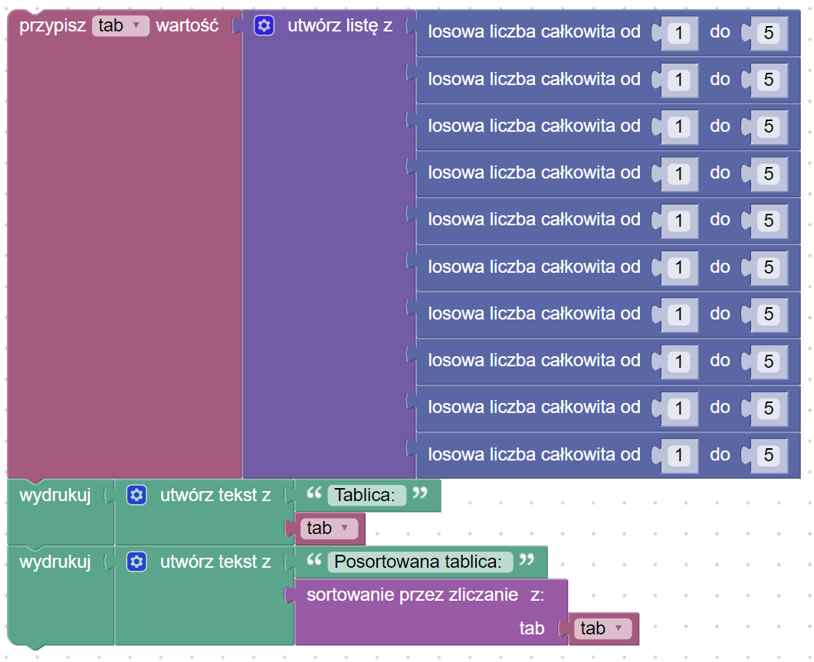

# Sortowanie przez zliczanie

## Opis problemu


[sortowanie-przez-zliczanie.md](../../../../algorytmy/sortowanie/sortowanie-przez-zliczanie.md)


## Implementacja

### Sortowanie

### Kod główny

### Link do implementacji


Sortowanie przez zliczanie

