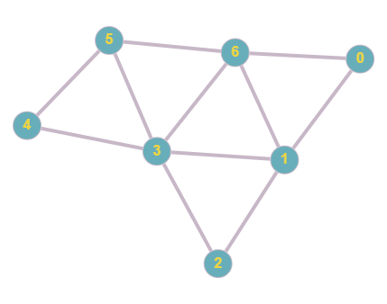

# DFS

## Opis problemu


[dfs.md](../../../../algorytmy/grafowe/dfs.md)


## Implementacja

```cpp
#include <iostream>
#include <vector>

using namespace std;

void dfs(vector<vector<int> > &graph, vector<bool> &visited, int node) {
    if (visited[node]) {
        return;
    }

    visited[node] = true;
    
    cout << "Visited node: " << node << endl;
    
    for (int i = 0; i < graph[node].size(); i++) {
        int nextNode = graph[node][i];
        if (!visited[nextNode]) {
            dfs(graph, visited, nextNode);
        }
    }
}

int main() {
	vector<vector<int> > graph = {
		{1,6}, 
		{0, 6, 3, 2},
		{1, 3},
		{2, 1, 6, 4, 5},
		{3, 5},
		{4, 3, 6},
		{0, 1, 3, 5},
	};

    vector<bool> visited = vector<bool>(graph.size(), false);

    dfs(graph, visited, 0);

    return 0;
}
```

### Link do implementacji


Przeszukiwanie grafu w głąb - DFS


### Opis implementacji

Na początku przygotowujemy przykładowy graf (**linie 24-32**) w formie listy sąsiedztwa zapisanej w dynamicznej tablicy typu `vector`. Przykładowy graf (przedstawiony także na poniższym rysunku) ma 7 wierzchołków (numerowanych od zera) i jest nieskierowany.

Po utworzeniu przykładowego grafu przygotowujemy tablicę `visited` i początkowo wypełniamy ją wartościami `false` (**linia 34**). W tej tablicy zapamiętujemy dla każdego wierzchołka, czy został on już odwiedzony, czy jeszcze nie. W tej implementacji korzystamy z dynamicznej tablicy typu `vector`, można jednak równie dobrze wykorzystać statyczną tablicę (jeżeli z góry znamy liczbę wierzchołków grafu).

Funkcja `dfs` (**linia 6**) jest funkcją rekurencyjną, która przyjmuje trzy parametry: graf, tablicę odwiedzonych wierzchołków oraz numer (identyfikator, indeks) aktualnie odwiedzanego wierzchołka. Na początku sprawdzamy, czy obecny wierzchołek został już odwiedzony (**linia 7**). Jeżeli tak, to kończymy działanie funkcji, nie chcemy ponownie przetwarzać już odwiedzonego wierzchołka. Jeżeli wierzchołek nie był jeszcze odwiedzony, to oznaczamy go jako odwiedzonego (**linia 11**), wpisując wartość `true` do tablicy `visited` pod indeksem przetwarzanego wierzchołka. Następnie wypisujemy numer aktualnie przetwarzanego wierzchołka (**linia 13**).

Główną częścią funkcji `dfs` jest pętla przechodząca przez wszystkich sąsiadów aktualnie przetwarzanego wierzchołka (**linia 15**). W pomocniczej zmiennej `nextNode` zapamiętujemy numer przetwarzanego sąsiada, pobranego z listy sąsiedztwa (**linia 16**). Następnie sprawdzamy, czy wierzchołek ten był już odwiedzony (**linia 17**), a jeżeli nie, to odwiedzamy go rekurencyjnie wywołując funkcję `dfs` z tym właśnie wierzchołkiem (**linia 18**).




