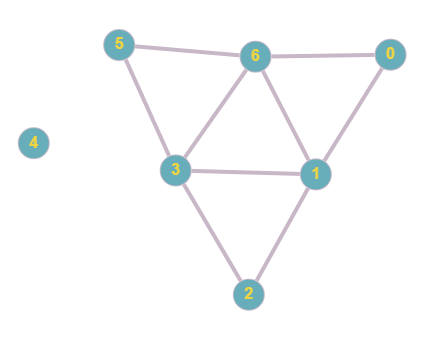

# Spójne składowe

## Opis problemu


[spojne-skladowe.md](../../../../algorytmy/grafowe/spojne-skladowe.md)


## Implementacja

```cpp
#include <iostream>
#include <vector>

using namespace std;

/// Incidence list of the graph
vector<vector<int> > graph;

/// True if node was visited, false otherwise
vector<bool> visited;

/// Prepares example graph adding vertices to incidence list
void prepareExampleGraph() {
    graph = vector<vector<int> >(7);
    graph[0].push_back(1);
    graph[0].push_back(6);

    graph[1].push_back(0);
    graph[1].push_back(6);
    graph[1].push_back(3);
    graph[1].push_back(2);

    graph[2].push_back(1);
    graph[2].push_back(3);

    graph[3].push_back(2);
    graph[3].push_back(1);
    graph[3].push_back(6);
    graph[3].push_back(5);

    graph[5].push_back(3);
    graph[5].push_back(6);

    graph[6].push_back(0);
    graph[6].push_back(1);
    graph[6].push_back(3);
    graph[6].push_back(5);
}

/// Recursive dfs algorithm
/// \param node - current node to visit
void dfs(int node) {
    if (visited[node]) {
        return;
    }

    visited[node] = true;
    for (int i = 0; i < graph[node].size(); i++) {
        int next_node = graph[node][i];
        if (!visited[next_node]) {
            dfs(next_node);
        }
    }
}

int countConnectedComponents() {
    int result = 0;
    visited = vector<bool>(graph.size(), false);
    for (int i = 0; i < graph.size(); i++) {
        if (!visited[i]) {
            result++;
            dfs(i);
        }
    }

    return result;
}

int main() {
    prepareExampleGraph();

    cout << "Number of connected components in the graph: " << countConnectedComponents() << endl;

    return 0;
}
```

### Link do implementacji


Zliczanie liczby spójnych składowych w grafie nieskierowanym


### Opis implementacji

TODO




