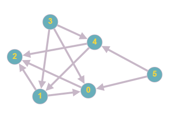

# Sortowanie topologiczne

## Opis problemu


[sortowanie-topologiczne.md](../../../../algorytmy/grafowe/sortowanie-topologiczne.md)


## Implementacja

```cpp
#include <iostream>
#include <vector>

using namespace std;

/// Incidence list of the graph
vector<vector<int> > graph;

/// Prepares example graph adding vertices to incidence list
void prepareExampleGraph() {
    graph = vector<vector<int> >(6);
    graph[0].push_back(2);

    graph[1].push_back(0);
    graph[1].push_back(2);

    graph[3].push_back(1);
    graph[3].push_back(0);
    graph[3].push_back(4);

    graph[4].push_back(2);
    graph[4].push_back(1);

    graph[5].push_back(0);
    graph[5].push_back(4);
}

vector<int> topologicalSort() {
    vector<int> in_ranks = vector<int>(graph.size());
    vector<bool> removed = vector<bool>(graph.size());
    vector<int> result;
    for (int i = 0; i < graph.size(); i++) {
        for (int j = 0; j < graph[i].size(); j++) {
            in_ranks[graph[i][j]]++;
        }
    }

    bool change = true;

    while (change && result.size() < graph.size()) {
        change = false;
        for (int i = 0; i < graph.size(); i++) {
            if (removed[i] || in_ranks[i] > 0) {
                continue;
            }

            change = true;
            result.push_back(i);
            removed[i] = true;
            for (int j = 0; j < graph[i].size(); j++) {
                in_ranks[graph[i][j]]--;
            }
        }
    }

    return result;
}

int main() {
    prepareExampleGraph();
    
    vector<int> result = topologicalSort();
    
    if (result.size() < graph.size()) {
        cout << "Graph has a cycle" << endl;
    } else {
        for (int i = 0; i < result.size(); i++) {
            cout << result[i] << " ";
        }

        cout << endl;
    }

    return 0;
}
```

### Link do implementacji


Sortowanie topologiczne


### Opis implementacji

TODO




