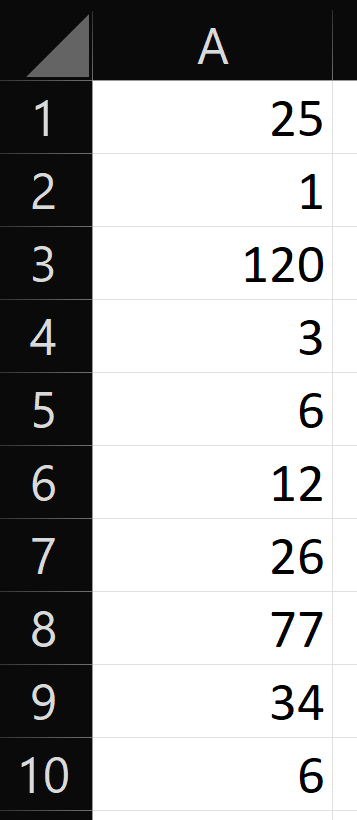

# Zaawansowane

## Zadanie 1

Napisz funkcję `SzukajMax`, która dla podanego zakresu komórek, znajdzie i zwróci jako wynik adres komórki zawierającej wartość maksymalną. Jeżeli kilka komórek zawiera tę wartość, funkcja powinna zwrócić adres pierwszej z nich.

### Przykład



```
SzukajMax(A1:A10) = $A$3
```
